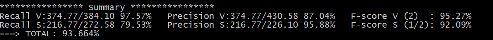

PAV - P2: detección de actividad vocal (VAD)
============================================

Esta práctica se distribuye a través del repositorio GitHub [Práctica 2](https://github.com/albino-pav/P2),
y una parte de su gestión se realizará mediante esta web de trabajo colaborativo.  Al contrario que Git,
GitHub se gestiona completamente desde un entorno gráfico bastante intuitivo. Además, está razonablemente
documentado, tanto internamente, mediante sus [Guías de GitHub](https://guides.github.com/), como
externamente, mediante infinidad de tutoriales, guías y vídeos disponibles gratuitamente en internet.


Inicialización del repositorio de la práctica.
----------------------------------------------

Para cargar los ficheros en su ordenador personal debe seguir los pasos siguientes:

*	Abra una cuenta GitHub para gestionar esta y el resto de prácticas del curso.
*	Cree un repositorio GitHub con el contenido inicial de la práctica (sólo debe hacerlo uno de los
	integrantes del grupo de laboratorio, cuya página GitHub actuará de repositorio central):
	-	Acceda la página de la [Práctica 3](https://github.com/albino-pav/P2).
	-	En la parte superior derecha encontrará el botón **`Fork`**. Apriételo y, después de unos segundos,
		se creará en su cuenta GitHub un proyecto con el mismo nombre (**P2**). Si ya tuviera uno con ese 
		nombre, se utilizará el nombre **P2-1**, y así sucesivamente.
*	Habilite al resto de miembros del grupo como *colaboradores* del proyecto; de este modo, podrán
	subir sus modificaciones al repositorio central:
	-	En la página principal del repositorio, en la pestaña **:gear:`Settings`**, escoja la opción 
		**Collaborators** y añada a su compañero de prácticas.
	-	Éste recibirá un email solicitándole confirmación. Una vez confirmado, tanto él como el
		propietario podrán gestionar el repositorio, por ejemplo: crear ramas en él o subir las
		modificaciones de su directorio local de trabajo al repositorio GitHub.
*	En la página principal del repositorio, localice el botón **Branch: master** y úselo para crear
	una rama nueva con los primeros apellidos de los integrantes del equipo de prácticas separados por
	guion (**fulano-mengano**).
*	Todos los miembros del grupo deben realizar su copia local en su ordenador personal.
	-	Copie la dirección de su copia del repositorio apretando en el botón **Clone or download**.
		Asegúrese de usar *Clone with HTTPS*.
	-	Abra una sesión de Bash en su ordenador personal y vaya al directorio **PAV**. Desde ahí, ejecute:

		```.sh
		git clone dirección-del-fork-de-la-práctica
		```

	-	Vaya al directorio de la práctica `cd P2`.
	-	Cambie a la rama **fulano-mengano** con la orden:

		```.sh
		git checkout fulano-mengano
		```

*	A partir de este momento, todos los miembros del grupo de prácticas pueden trabajar en su directorio
	local del modo habitual.
	-	También puede utilizar el repositorio remoto como repositorio central para el trabajo colaborativo
		de los distintos miembros del grupo de prácticas; o puede serle útil usarlo como copia de seguridad.
	-	Cada vez que quiera subir sus cambios locales al repositorio GitHub deberá confirmar los
		cambios en su directorio local:

		```.sh
		git add .
		git commit -m "Mensaje del commit"
		```

		y, a continuación, subirlos con la orden:

		```.sh
		git push -u origin fulano-mengano
		```

*	Al final de la práctica, la rama **fulano-mengano** del repositorio GitHub servirá para remitir la
	práctica para su evaluación utilizando el mecanismo *pull request*.
	-	Vaya a la página principal de la copia del repositorio y asegúrese de estar en la rama
		**fulano-mengano**.
	-	Pulse en el botón **New pull request**, y siga las instrucciones de GitHub.


Entrega de la práctica.
-----------------------

Responda, en este mismo documento (README.md), los ejercicios indicados a continuación. Este documento es
un fichero de texto escrito con un formato denominado _**markdown**_. La principal característica de este
formato es que, manteniendo la legibilidad cuando se visualiza con herramientas en modo texto (`more`,
`less`, editores varios, ...), permite amplias posibilidades de visualización con formato en una amplia
gama de aplicaciones; muy notablemente, **GitHub**, **Doxygen** y **Facebook** (ciertamente, :eyes:).

En GitHub. cuando existe un fichero denominado README.md en el directorio raíz de un repositorio, se
interpreta y muestra al entrar en el repositorio.

Debe redactar las respuestas a los ejercicios usando Markdown. Puede encontrar información acerca de su
sintáxis en la página web [Sintaxis de Markdown](https://daringfireball.net/projects/markdown/syntax).
También puede consultar el documento adjunto [MARKDOWN.md](MARKDOWN.md), en el que se enumeran los elementos
más relevantes para completar la redacción de esta práctica.

Recuerde realizar el *pull request* una vez completada la práctica.

Ejercicios
----------

### Etiquetado manual de los segmentos de voz y silencio

- Etiquete manualmente los segmentos de voz y silencio del fichero grabado al efecto. Inserte, a 
  continuación, una captura de `wavesurfer` en la que se vea con claridad la señal temporal, el contorno de
  potencia y la tasa de cruces por cero, junto con el etiquetado manual de los segmentos.


- A la vista de la gráfica, indique qué valores considera adecuados para las magnitudes siguientes:

	* Incremento del nivel potencia en dB, respecto al nivel correspondiente al silencio inicial, para estar
      seguros de que un segmento de señal se corresponde con voz.

	Fixant-nos en la gràfica on es representa la potència veiem que, aproximadament, el nivell de potència de silenci 
	inicial és de 2dB. Valorant els espais temporals de veu on la potència és menor (25-30dB), pensem que un increment 
	de potència raonable seria de 20dB.

	* Duración mínima razonable de los segmentos de voz y silencio.

	Mirant la nostra transcripció pensem que un temps de mínim silenci raonable és de 250 ms.
        Pel que fal al temps mínim de veu, pensem que 200 ms és suficient.

	* ¿Es capaz de sacar alguna conclusión a partir de la evolución de la tasa de cruces por cero?

	Si es un fitxer amb poc soroll podem extreure conclusions de la ZCR, per exemple, quan es tracta 
	de fonemes fricatius (f, s). 	Però, si el fitxer conté un nivell de soroll mitjà no som capaços 
	d'extreure cap conclusió a partir d'aquest paràmetre, ja que 	en els trams de silenci el valor de 
	la ZCR es dispara.

### Desarrollo del detector de actividad vocal

- Complete el código de los ficheros de la práctica para implementar un detector de actividad vocal tan
  exacto como sea posible. Tome como objetivo la maximización de la puntuación-F `TOTAL`.

- Inserte una gráfica en la que se vea con claridad la señal temporal, el etiquetado manual y la detección
  automática conseguida para el fichero grabado al efecto. 
 


- Explique, si existen. las discrepancias entre el etiquetado manual y la detección automática.

	Com podem observar a la següent captura de la senyal:


	Podem trobar discrepancies mínimes en alguns casos, com per exemple en aquests dos trams de senyal, 
	on d'una banda, tenim un tram de silenci en el qual el nostre programa a inclós un subtram de veu (V), 
	degut a un petit increment en la potència de la senyal. 

	D'altra banda, tenim el cas contrari, on el nostre programa ha designat com a tram de silenci (S) 
	el so la fricativa labiodental 'v', degut a la disminució de la potència de la senyal en aquest tram. 
	Observem a partir de la gràfica de la tasa ZCR que aquest últim cas podria haver estar corregit, 
	tenint en compte que durant la pronuncia de la consonant, el ZCR ha augmentat considerablement. No 
	obstant això, tal i com hem comentat amb anterioritat, això només haugés estat possible en casos 
	com aquest on el soroll de fons de l'audio és practicament inapreciable.

	Finalment, també tenim petits errors en els trams finals de paraula, com s'aprecia en diverses
	parts de l'audio, on considerem com a veu trams els trams baixa potència que en realitat són ja de silenci.


- Evalúe los resultados sobre la base de datos `db.v4` con el script `vad_evaluation.pl` e inserte a 
  continuación las tasas de sensibilidad (*recall*) y precisión para el conjunto de la base de datos (sólo
  el resumen).



	Des del nostre punt de vista, creiem que una precisió del 93.6% és un molt bon resultat. Analitzant
	aquells audios on obtenim una menor precisió, observem que són aquells on hi ha un major nivell de soroll,
	el locutor fa servir un to de veu molt baix, o directament considerem que no estan ben etiquetats.

	Per tal de millorar els resultats obtinguts, considerem que en alguns casos podria ser adecuat fer servir
	les mesures de l'amplitud o el ZCR, a part de mirar d'ajustar encara més els paràmetres corresponents als
	diferents llindars de Veu, Soroll, o Undefined.


### Trabajos de ampliación

#### Cancelación del ruido en los segmentos de silencio

- Si ha desarrollado el algoritmo para la cancelación de los segmentos de silencio, inserte una gráfica en
  la que se vea con claridad la señal antes y después de la cancelación (puede que `wavesurfer` no sea la
  mejor opción para esto, ya que no es capaz de visualizar varias señales al mismo tiempo).

#### Gestión de las opciones del programa usando `docopt_c`

- Si ha usado `docopt_c` para realizar la gestión de las opciones y argumentos del programa `vad`, inserte
  una captura de pantalla en la que se vea el mensaje de ayuda del programa.


### Contribuciones adicionales y/o comentarios acerca de la práctica

- Indique a continuación si ha realizado algún tipo de aportación suplementaria (algoritmos de detección o 
  parámetros alternativos, etc.).

	Voliem destacar que per tal d'obtenir la màxima precisió, hem optat per generar un algoritme adaptatiu
	pels paràmetres	alfa1 i alfa2, de manera que vam realitzar diverses mesures tant en els audios que 
	tenien un major nivell de soroll, com aquells que tenien un major nivell de qualitat (menys soroll), i 
	vam estimar quins serien els valors alfa1 i alfa2 més addients per aquells casos. D'aquesta forma,
	vam calcular els paràmetres mitjançant una funció lineal, ja que vam decretar que els llindars
	alfa1 i alfa2 havíen de ser majors com menor fos el nivell de soroll, i assolien el seu mínim en audios
	amb un major soroll de fons. Per tant, després d'ajustar les funcions per tots dos paràmetres, vam obtenir
	que els millors valors eren:

	a1 = -0.08 * k0 + 2.0;
	a2 = -0.036 * a1 + 1.8;

- Si lo desea, puede realizar también algún comentario acerca de la realización de la práctica que considere
  de interés de cara a su evaluación.


### Antes de entregar la práctica

Recuerde comprobar que el repositorio cuenta con los códigos correctos y en condiciones de ser 
correctamente compilados con la orden `meson bin; ninja -C bin`. El programa generado (`bin/vad`) será
el usado, sin más opciones, para realizar la evaluación *ciega* del sistema.
